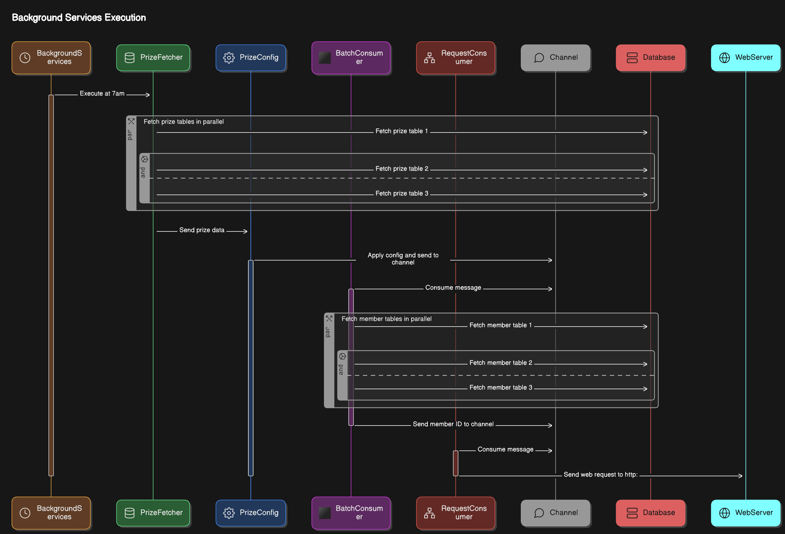

# IssuranceConsumer

The `IssuranceConsumer` is a .NET 8 application with low allocation,parallely and async that handles insurance-related tasks. It uses a microservices architecture and relies on various dependencies and technologies to ensure high performance and reliability.

## Requirements

- Microsoft SQL Server 
- .NET 8 (required for performance)

## Dependencies

- [ZLogger](https://github.com/ZLogger/ZLogger): Zero Allocation Text/Structured Logger for .NET and Unity, with StringInterpolation and Source Generator
- [HyperLinq](https://github.com/NetFabric/NetFabric.Hyperlinq): High-performance LINQ implementation with minimal heap allocations
- [Microsoft.Extensions.Http.Resilience](https://www.nuget.org/packages/Microsoft.Extensions.Http.Resilience): Provides resilience features for HTTP clients
- [Hangfire](https://www.hangfire.io/): An easy and reliable way to perform fire-and-forget, delayed and recurring, long-running, short-running, CPU or I/O intensive tasks
- [Flurl](https://flurl.dev/): Fluent URL building and wrist-friendly HTTP client for .NET
- [Microsoft.EntityFrameworkCore](https://docs.microsoft.com/en-us/ef/core/): Entity Framework Core, an object-relational mapping (ORM) framework

## Databases

The `IssuranceConsumer` project requires the following databases:

1. **Issurance Database**: This database stores the core insurance-related data.
2. **Hangfire Database**: This database is used by the Hangfire library for scheduling and managing tasks. It can also use Redis for better performance.

## Main Technologies

1. **Channel**: The project uses channels as the main messaging queue for internal communication between modules.
2. **AsyncEnumerable**: The project leverages async streams (AsyncEnumerable) for efficient LINQ-related operations.

## Installation and Configuration

1. Clone the repository:
   ```
   git clone https://github.com/{ it is private yet hahahah}/IssuranceConsumer.git
   ```
2. Install the required dependencies:
   ```
   cd IssuranceConsumer
   dotnet restore
   ```
3. Configure the project:
   - Update the connection strings for the Issurance and Hangfire databases in the `appsettings.json` file.
   - Configure any other necessary settings, such as logging, monitoring, and deployment-specific options.
4. Build and run the project:
   ```
   dotnet build
   dotnet run
   ```
## App Settings 
Inside the app folder,  you should provide the appsettings      
```json 
{
  "Logging": {
    "LogLevel": {
      "Default": "Information",
      "Microsoft.AspNetCore": "Warning",
      "Hangfire": "Information",
      "Microsoft": "Information",
      "Microsoft.Hosting.Lifetime": "Information",
      "Microsoft.EntityFrameworkCore.Database.Command": "Warning",
      "System.Net.Http.HttpClient": "Warning",
      "Polly": "None"
    }
  },
  "ConnectionStrings": {
    "IssuranceDB": "data source=.;initial catalog=YourDb;user id=sa;password=YourPassword;Encrypt=True;TrustServerCertificate=True",
    "Hangfire": "data source=.;initial catalog=YourDb;user id=sa;password=YourPassword;Encrypt=True;TrustServerCertificate=True"
  }

}
```
## Logging and Monitoring

The project uses the ZLogger library for logging, which provides zero-allocation text and structured logging. The logs can be accessed through a central logging service or by examining the log files in the project's directory.

The project also includes monitoring capabilities to track the health and performance of the various components. This includes metrics such as message processing rates, database query times, and web request response times.

the rolling file is `logs/{timestamp.ToLocalTime():yyyy-MM-dd}_{sequenceNumber:000}.log`

## Resilience
### Database with pooling , retries 
pooling different dbcontext , and enable retry 
```csharp
 public static IServiceCollection ConfigDb(this IServiceCollection services, string connectionStr)
    {
        services.AddPooledDbContextFactory<InsurancesContext>(options =>
                 {
                     options.UseSqlServer(connectionStr,
                                          serviceOptions =>
                                              serviceOptions
                                                 .EnableRetryOnFailure(10));
                 })
                .AddScoped(p => p
                               .GetRequiredService<
                                    IDbContextFactory<InsurancesContext>>()
                               .CreateDbContext()); //add a default scoped in case ppl get it wrong
        return services;
    }
```
### Http 
provding predicate to handle any cases we wanted
```csharp 
   public static IServiceCollection ConfigHttpClients(this IServiceCollection services)
    {
        services.AddHttpClient("productEndpoints", client =>
                 {
                     client.DefaultRequestHeaders.Add("Keep-Alive", "false");
#if DEBUG
                     client.BaseAddress = new Uri("https://localhost:7132/");
#else
                    client.BaseAddress = new Uri("https://10.0.10.100/");
#endif
                 })
                .AddStandardResilienceHandler(options =>
                 {
                     // Customize retry
                     options.Retry.ShouldHandle = new PredicateBuilder<HttpResponseMessage>()
                                                 .Handle<TimeoutRejectedException>()
                                                 .Handle<HttpRequestException>();
                     //       .HandleResult(response => response.IsSuccessStatusCode == false);
                     options.Retry.MaxRetryAttempts = 5;
                 });
        return services;
    }
```
## Tune for performance 
tune how many consumer to run the work for us ,in this example , prize table has 3 services to fetch , issue request has 100.
```csharp 
 public static IServiceCollection AddChannels(this IServiceCollection services)
    {
        // TODO inject as keyed services , since it so misunderstanding after a period of time
        services.AddSingleton(Channel.CreateUnbounded<PrizeConfig>(new UnboundedChannelOptions
                                                                       { SingleWriter = true, SingleReader = false }));
        services.AddSingleton(Channel.CreateUnbounded<List<IssueModel>>(new UnboundedChannelOptions
        {
            SingleWriter = false, SingleReader = false
        }));
        for (var i = 0; i < 3; i++) // should be in IConfigure appsettings
            services
               .AddSingleton<IHostedService,
                    BatchingMemberBackgroundServices>(); // dont use addHostServices here , will bomb with lower .net version
        for (var i = 0; i < 100; i++) // should be in IConfigure appsettings
            services
               .AddSingleton<IHostedService,
                    RequestProducerBackgroundServices>(); // dont use addHostServices here , will bomb with lower .net version

        services.AddSingleton<IPrizeConfigProvider, PrizeConfigProvider>();
        services.AddScoped<IPrizeProcessor, GeneralBatchProcessor>();

        return services;
    }

```
## Async fetch with AsyncEnumerable
example to using async enumerable
```csharp 
  var prizes = context.Prizes.AsNoTracking()
                            .Where(x => supportedConfig.Contains(x.PrizeCode))
                            .Select(y => y.PrizeCode)
                            .AsAsyncEnumerable();
        await foreach (var prizeCode in prizes) 
        {
            var config = prizeConfigProvider.GetConfigByPrize(prizeCode);
```
## Cancel Reflection 
Source Generator is used during json ser/derserailaztion.   
### json
```csharp 
[JsonSourceGenerationOptions(WriteIndented = true)]
[JsonSerializable(typeof(IssueModel))
```
### logging 
```csharp
 [ZLoggerMessage(LogLevel.Information, Message = "Begin Services:[{servicesName}|{id}]")]
    public static partial void LogBeginServices(this ILogger logger, string servicesName, string id);
```

## Producer and Consumer 
example for producing 
```csharp 
  await
                    channel.Writer
                           .WriteAsync([.. members.AsValueEnumerable().Select(y => y.ToIssueModel(config.PrizeName, config.IssuesQuantity))],
                                       token);
```
example for consuming
```csharp
var             config            = await channel.Reader.ReadAsync(cancellationToken);
await batchingProcessor.ProduceToRequestQueeueAsync(config, cancellationToken);
```